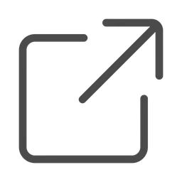
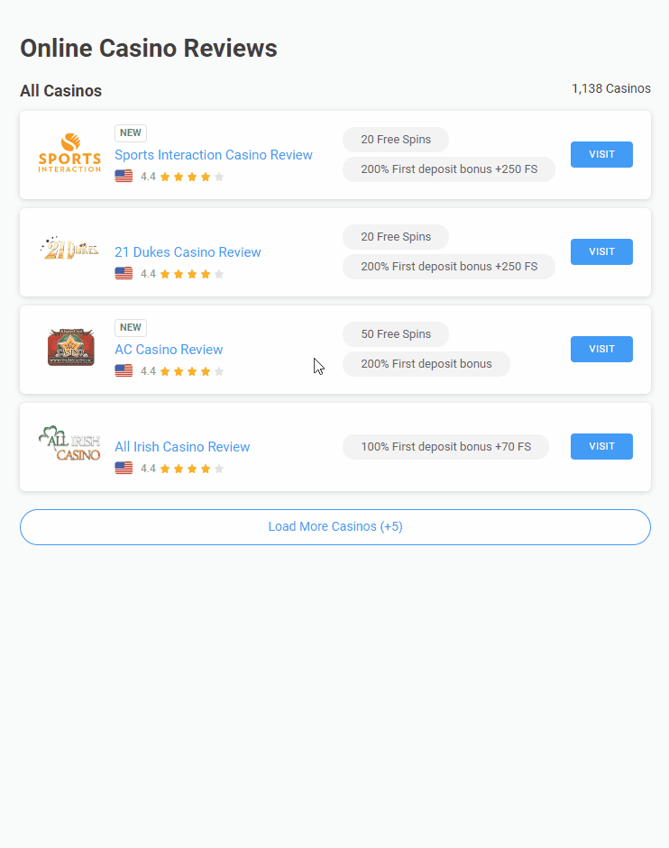
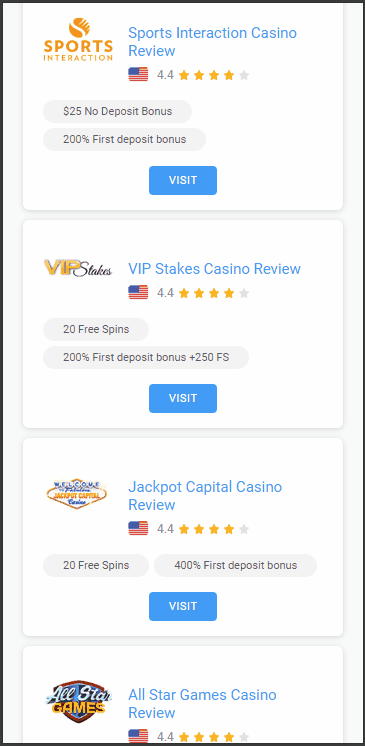

# Hi there 👋

Here you can find some of my demo projects.

# Demos

1. [Casino Reviews Page](#casino-reviews-page)
    
    * [Readme ](https://github.com/llamerr-demo-projects/casino-reviews?tab=readme-ov-file#info)
    
    * [Demo ](https://llamerr-demo-projects.github.io/casino-reviews/casino-reviews.html)

## Casino Reviews Page

https://llamerr-demo-projects.github.io/casino-reviews/casino-reviews.html

This project is a pixel perfect HTML, CSS and JavaScript (no frameworks) implementation of the provided Adobe XD design. The final result should be uploaded to GitHub or GitLab and should be accessible via a link. The page should include the implemented functionalities from the prototype (Load More, popup, copy-code).

Desktop version:

Mobile version:

