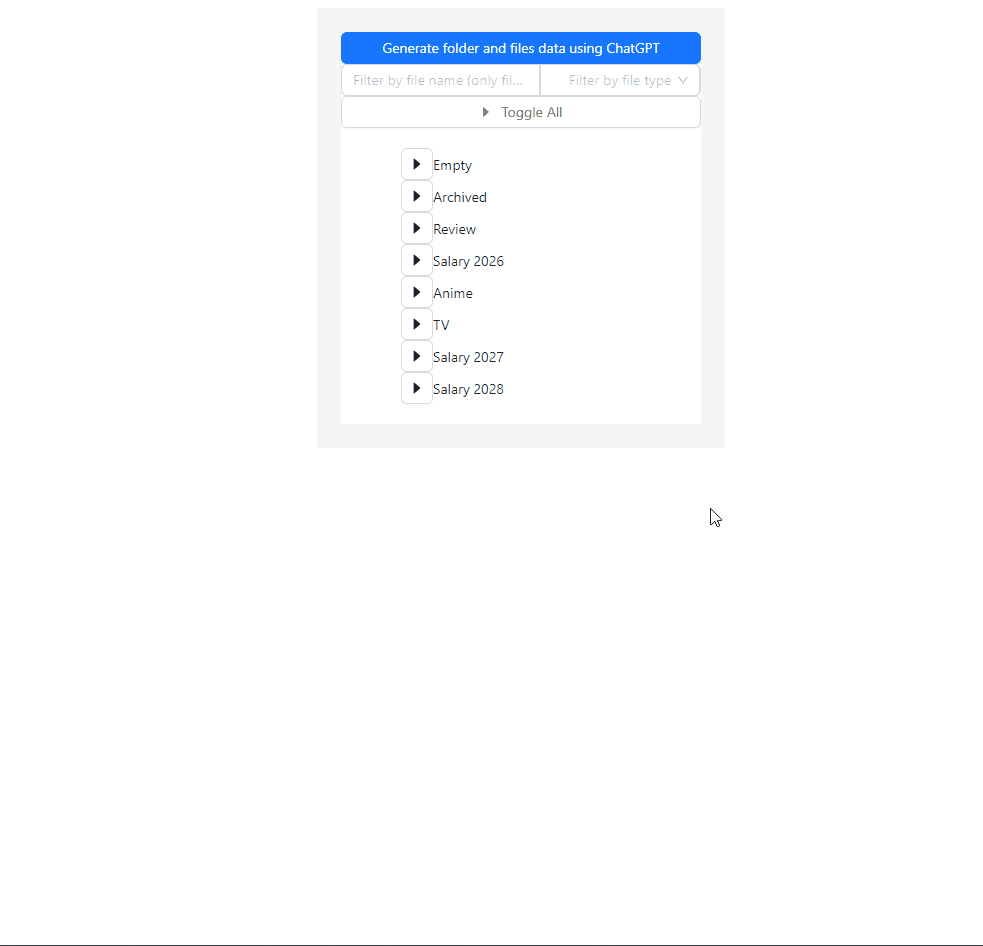
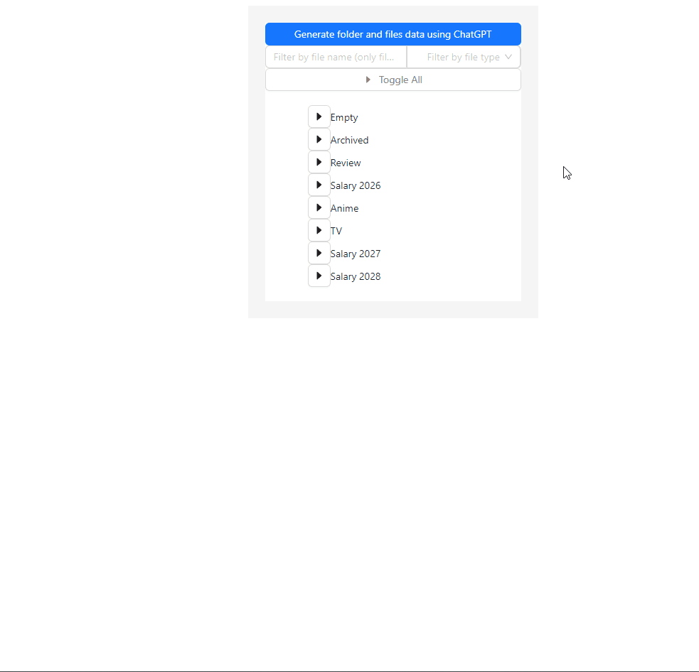
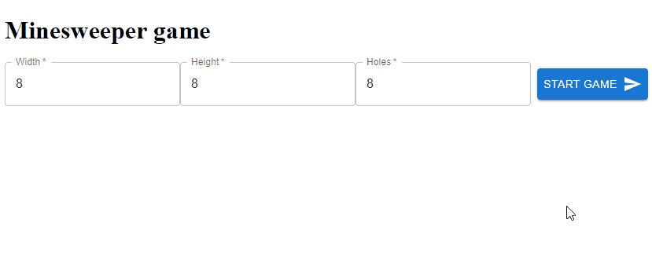

# Hi there 👋

Here you can find some of my demo projects.

# Demos

1. [AdventJS challenges](#advent-js)
    
1. [Casino Reviews Page](#casino-reviews-page)
    
    * [Readme ](https://github.com/llamerr-demo-projects/casino-reviews?tab=readme-ov-file#info)
    
    * [Demo ](https://llamerr-demo-projects.github.io/casino-reviews/casino-reviews.html)

1. [File Tree](#file-tree)
    
    * [Readme ](https://github.com/llamerr-demo-projects/files-tree?tab=readme-ov-file#info)
    
    * [Demo ](https://llamerr-demo-projects.github.io/files-tree/)

1. [Minesweeper Game](#minesweeper-game)    

## AdventJS challenges

For 2023 challenges: https://github.com/llamerr-demo-projects/adventjs-2023

For 2024 challenges: https://github.com/llamerr-demo-projects/adventjs-2024

Solutions to challanges at https://adventjs.dev/

Install stuff with `pnpm install` Run tests with `pnpm test`

All solved (so far) tasks with basic tests are located

here: https://github.com/llamerr-demo-projects/adventjs-2023/tree/master/src/tasks

or here: https://github.com/llamerr-demo-projects/adventjs-2024/tree/master/src/tasks

You can test how good they score at the site itself

## Casino Reviews Page

https://llamerr-demo-projects.github.io/casino-reviews/casino-reviews.html

This project is a pixel perfect HTML, CSS and JavaScript (no frameworks) implementation of the provided Adobe XD design. The final result should be uploaded to GitHub or GitLab and should be accessible via a link. The page should include the implemented functionalities from the prototype (Load More, popup, copy-code).

Desktop version:

Mobile version:

## File Tree

https://llamerr-demo-projects.github.io/files-tree/

This project is an implementation of File Tree browser with option to filter files by type and by name.
Additional features include mock data generation using LLM.

Implementation:

Generating mock data using LLM:

## Minesweeper Game

https://mine-sweeper-seven.vercel.app/

Customizable Minesweeper game with option to select field size and number of mines.

https://github.com/llamerr-demo-projects/mine-sweeper

